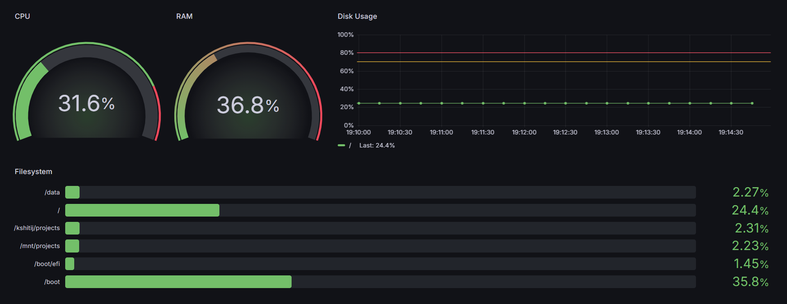

# RHEL 10 Monitoring Stack

Self-hosted monitoring stack built on RHEL 10 using Prometheus,
Node Exporter, and Grafana — monitoring both Linux VM and Windows host.

## Architecture
rhel10-srv (localhost)
├── Node Exporter  :9100  → Linux metrics
├── Prometheus     :9091  → Scrapes & stores metrics
└── Grafana        :3000  → Dashboards & visualization
Windows Host (localhost)
└── windows_exporter :9182 → Windows metrics

## Stack

| Component         | Version  | Port |
|-------------------|----------|------|
| Node Exporter     | v1.10.2  | 9100 |
| Prometheus        | v3.4.0   | 9091 |
| Grafana           | Latest   | 3000 |
| windows_exporter  | v0.31.7  | 9182 |

## Features

- Live CPU, RAM, Disk, Network monitoring
- Custom Grafana dashboard with PromQL queries
- Systemd service integration with SELinux hardening
- Windows host monitoring via windows_exporter
- Persistent storage via LVM on RHEL 10
- Container auto-start using Podman Quadlet

## Setup Guide

See [docs/setup-guide.md](docs/setup-guide.md) for full installation steps.

## Screenshots

## Key Configs

- `prometheus/prometheus.yml` — Scrape targets config
- `grafana/rhel10-dashboard.json` — Exported dashboard JSON
- `node-exporter/node_exporter.service` — systemd unit file

## Environment

- OS: Red Hat Enterprise Linux 10
- Hypervisor: VMware Workstation
- Host: rhel10-srv | IP: 192.168.8.100
